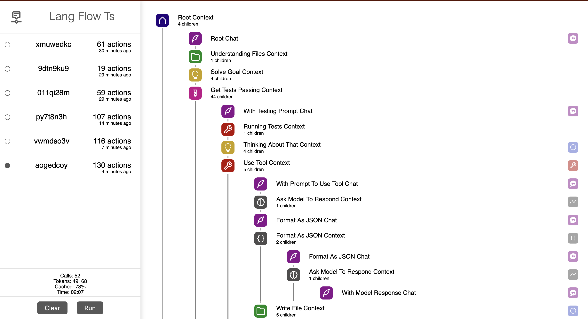

# Lang Flow TS

A powerful AI agent written in pure typescript with clean visualization.

This is a project for creating and visulizing AI coding agents. An output is created and run that shows exactly what the agent is doing and what process it goes through.



## Example

Given the prompt of:

> Given an empty repository, write calculator application that exposes a function that takes in a string and returns the result of the calculation. Assume you have already chosen to use typescript. You should only include steps that are pure coding steps such as writing content and running tests. You are not intending to publish this application, deploy it, or do anything other than write the code. This should be a single repo. Furthermore, you will have no direct outside help, you may 'plan' but you may not do online research. You may use packages if you want. Assume you have good knowledge of the language and the libraries you are using.

The project is able to generate a dozen+ files all working together to sole the problem with propper unit testing support. It breaks it down into a seriese of individual commits for easier code reviews.

## Setup

1. Get open ai api key (gpt4 is a must, gpt3 is not smart enought for this)
2. Clone repo
3. Place key in singularity/tst/test.ts where prompted
4. Start the website in the first terminal window, this reads any data in the logs files generated from the bot

    ```
        cd website
        npm install
        npm run start
    ```

5. Start the bot in another terminal window

    ```
        cd singularity
        npm install
        npm run test 
    ```

6. Open browser to `localhost:3000`, see it run


