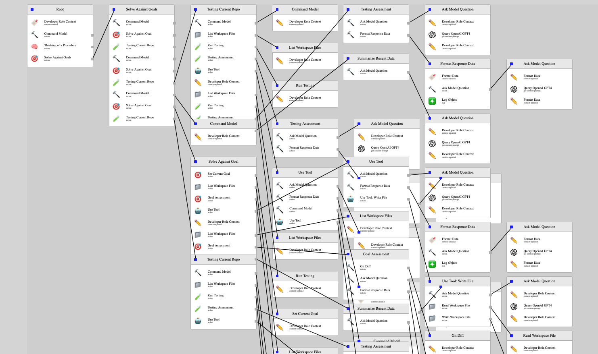

# Lang Flow TS

This is a project for creating and visulizing AI coding agents. An output is created and run that shows exactly what the agent is doing and what process it goes through.




Short video if it setting up a rep for itself:

<video controls="controls" width="800" height="600" name="Video Name">
  <source src="./imgs/m.mov">
</video>


## Example

Given the prompt of:

```
Given an empty repository, write calculator application that exposes a function that takes in a string and returns the result of the calculation. Assume you have already chosen to use typescript. You should only include steps that are pure coding steps such as writing content and running tests. You are not intending to publish this application, deploy it, or do anything other than write the code. This should be a single repo. Furthermore, you will have no direct outside help, you may 'plan' but you may not do online research. You may use packages if you want. Assume you have good knowledge of the language and the libraries you are using.
```

The model creates ALL of the following files, with passing tests in jest. None of these files were provided to it.


## Setup

1. Get open ai api key (gpt4 is a must, gpt3 is not smart enought for this)
2. Clone repo
3. Place key in website/src/singularity/start.ts where prompted
4. Start the interface in the first terminal window, this controls file reading and writing + caching

    ```
        cd agentInterface
        npm install
        npm run start
    ```

5. Start the website in another terminal window, this is the UI and will automatically start running the flow setup in `website/src/workspace/test.ts`

    ```
        cd website
        npm install
        npm run start
    ```

6. Open browser to `localhost:3000`, see it run
7. Control view with following

    - Click to hide nodes
    - `R` to reformat nodes
    - `Q` to kill network 
    - `E` to hide all nodes

